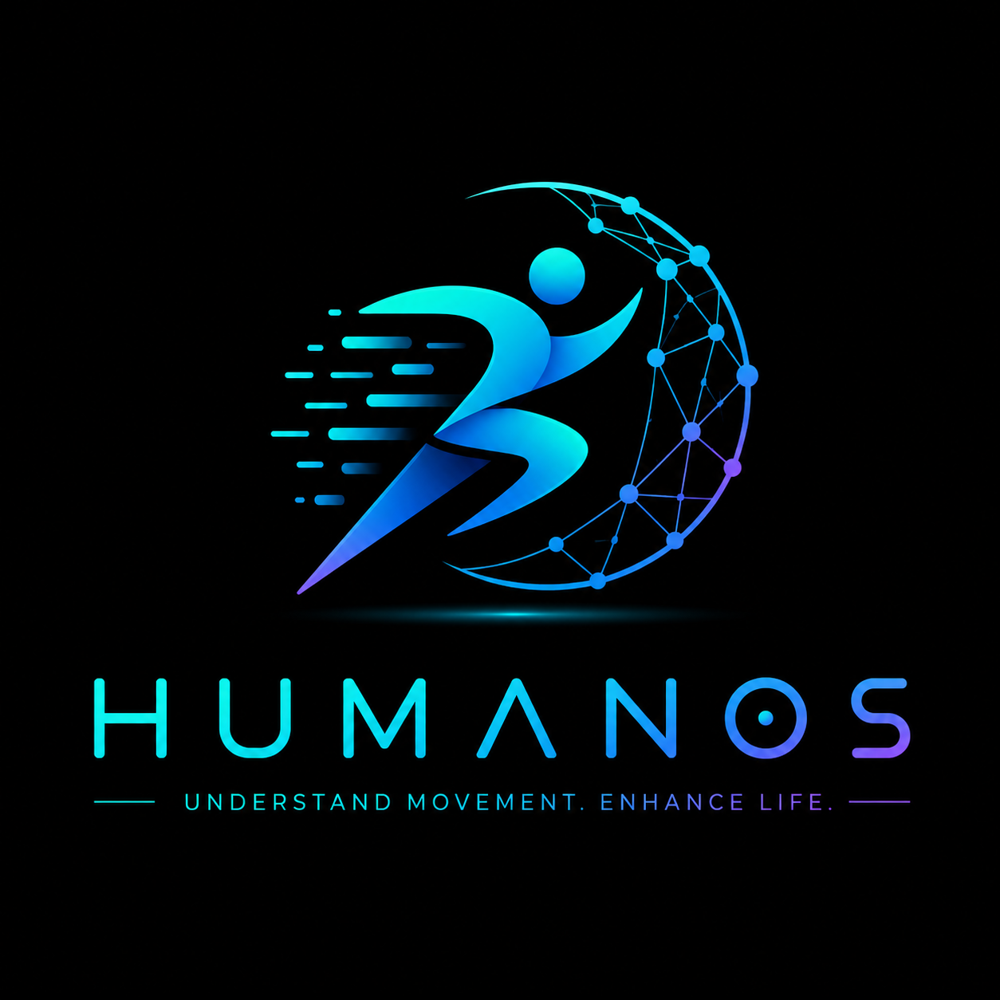

<p align="center">
  
</p>

<h1 align="center">HumanOS</h1>

<p align="center">
  <strong>The Privacy-First Human Intelligence Platform</strong>
</p>

<p align="center">
  <em>Enabling computers to understand human movement, behavior, physical state, and future risks — without compromising privacy.</em>
</p>

<p align="center">
  <a href="#-quick-start">Quick Start</a> •
  <a href="#-architecture">Architecture</a> •
  <a href="#-roadmap">Roadmap</a> •
  <a href="#-contributing">Contributing</a> •
  <a href="docs/">Documentation</a>
</p>

---

## Table of Contents

1. [Project Vision](#1--project-vision)
2. [Problem Statement](#2--problem-statement)
3. [Motivation](#3--motivation)
4. [Why Existing Approaches Are Insufficient](#4--why-existing-approaches-are-insufficient)
5. [Goals](#5--goals)
6. [Non-Goals](#6--non-goals)
7. [Key Features](#7--key-features)
8. [Core Architecture Overview](#8--core-architecture-overview)
9. [High-Level Data Flow](#9--high-level-data-flow)
10. [Repository Structure](#10--repository-structure)
11. [Technology Stack](#11--technology-stack)
12. [Planned Modules](#12--planned-modules)
13. [Development Roadmap](#13--development-roadmap)
14. [Privacy Principles](#14--privacy-principles)
15. [Security Considerations](#15--security-considerations)
16. [Ethical Considerations](#16--ethical-considerations)
17. [Performance Goals](#17--performance-goals)
18. [Testing Strategy](#18--testing-strategy)
19. [Contribution Guidelines](#19--contribution-guidelines)
20. [Coding Standards](#20--coding-standards)
21. [Branch Strategy](#21--branch-strategy)
22. [Versioning Policy](#22--versioning-policy)
23. [Documentation Standards](#23--documentation-standards)
24. [Deployment Philosophy](#24--deployment-philosophy)
25. [Future Roadmap](#25--future-roadmap)
26. [Frequently Asked Questions](#26--frequently-asked-questions)
27. [License](#27--license)
28. [Glossary](#28--glossary)

---

## 1 · Project Vision

HumanOS is the world's first operating system for **human motion intelligence**.

Just as Linux provides an operating system for computing hardware, and the OpenAI API provides an interface for language intelligence, HumanOS provides **reusable infrastructure for understanding human movement, behavior, physical state, and future risks**.

| Analogy | Domain | What It Provides |
|---------|--------|------------------|
| **Linux** | Computing | OS kernel, drivers, process management |
| **OpenAI API** | Language | Text understanding, generation, reasoning |
| **HumanOS** | Human Motion | Movement understanding, prediction, risk reasoning |

HumanOS is **not** another action recognition system. Action recognition answers *"What label describes this motion clip?"* — a narrow, retrospective classification task.

HumanOS answers fundamentally different questions:

> **What is happening to this person?**
> **What is likely to happen next?**
> **How can software intervene before something goes wrong?**

These questions require a shift from **classification** to **representation, prediction, and reasoning** — and that shift is at the heart of this project.

---

## 2 · Problem Statement

Computers today are nearly blind to the humans operating alongside them.

- **Industrial robots** cannot predict when a worker is about to step into a danger zone.
- **Healthcare systems** cannot detect gradual mobility decline before a fall occurs.
- **Vehicles** cannot reason about whether a driver's fatigue is accumulating across a shift.
- **Rehabilitation software** cannot track whether a patient's gait is improving or degrading between clinic visits.

Existing computer vision systems can *label* activities — "walking," "sitting," "waving" — but they cannot build a **continuous, evolving model** of a person's physical state. They lack the ability to:

1. **Accumulate context** over time (a single stumble vs. a pattern of instability).
2. **Predict future states** (fall risk increasing over the next 30 seconds).
3. **Reason about causality** (fatigue → posture degradation → injury risk).
4. **Preserve privacy** while doing all of the above.

HumanOS exists to close this gap.

---

## 3 · Motivation

### 3.1 The Human Cost of Reactive Systems

Every year:

- **37.3 million falls** require medical attention globally (WHO).
- **2.3 million workers** suffer serious workplace injuries in the US alone (BLS).
- **1.35 million people** die in road traffic crashes, with driver inattention as a leading cause (WHO).
- **Millions of rehabilitation patients** lack continuous monitoring between clinical visits.

These are not problems of detection — they are problems of **prediction and intervention**. By the time an event is detected, it is already too late.

### 3.2 The Gap Between Research and Infrastructure

Academic research has produced remarkable advances in pose estimation (MediaPipe, OpenPose, ViTPose), action recognition (ST-GCN, MS-G3D, CTR-GCN), and activity understanding. However:

- These advances remain **siloed in research papers**.
- No reusable platform exists that **composes** these capabilities into an integrated stack.
- No infrastructure enforces **privacy by design** at the architectural level.
- No standard API exists for applications to query **human state**.

HumanOS bridges the gap between research breakthroughs and production-grade, privacy-preserving infrastructure.

### 3.3 Why Now?

Three converging trends make this project timely:

1. **Pose estimation maturity**: Real-time, accurate 2D/3D pose extraction is now commodity technology.
2. **Graph neural network advances**: Spatiotemporal graph models can encode skeletal motion with high fidelity.
3. **Edge compute availability**: Modern edge devices (NVIDIA Jetson, Apple Neural Engine, Coral TPU) can run complex inference locally, enabling privacy-preserving pipelines.

---

## 4 · Why Existing Approaches Are Insufficient

### 4.1 Action Recognition ≠ Human Understanding

| Capability | Action Recognition | HumanOS |
|---|---|---|
| **Output** | Discrete label ("walking") | Continuous state vector + predictions |
| **Temporal scope** | Single clip (2–10 seconds) | Continuous stream (minutes to hours) |
| **Context accumulation** | None | Sliding window + long-term memory |
| **Prediction** | None | Future state forecasting |
| **Causal reasoning** | None | Why → What → What next |
| **Privacy model** | Often requires raw video | Skeleton-first, video-deleted pipeline |
| **Reusability** | Model-specific | Platform with standard APIs |

### 4.2 Fragmented Ecosystem

Today, a developer building a fall-detection system must:

1. Select and integrate a pose estimation library.
2. Preprocess and normalize skeleton data.
3. Train a custom model from scratch.
4. Build their own inference pipeline.
5. Handle privacy, deployment, and monitoring independently.

This is analogous to building a web application in the 1990s — before web frameworks, ORMs, and cloud platforms existed. HumanOS provides the **framework layer** that eliminates this redundant work.

### 4.3 Privacy as an Afterthought

Existing systems treat privacy as a compliance checkbox. HumanOS treats privacy as **architectural bedrock**:

- Raw video is processed and discarded at the sensor boundary.
- All downstream analysis operates on **anonymous skeletal graphs**.
- Identity is architecturally separated from movement and prediction.

---

## 5 · Goals

### Primary Goals

| # | Goal | Description |
|---|------|-------------|
| G1 | **Reusable Human Motion Representations** | Build dense, transferable motion embeddings that generalize across tasks. |
| G2 | **Privacy-by-Design Architecture** | Ensure raw video never persists beyond pose extraction by default. |
| G3 | **Predictive Human Understanding** | Move beyond classification to forecast future physical states and risks. |
| G4 | **Modular, Evolvable Platform** | Design a layered architecture where any component can be upgraded independently. |
| G5 | **Developer-Friendly API** | Provide clean, documented APIs so application developers never touch raw model internals. |
| G6 | **Edge-to-Cloud Flexibility** | Support deployment from Raspberry Pi to multi-GPU cloud clusters. |
| G7 | **Research-Grade Rigor** | Maintain reproducible experiments, model cards, and benchmark tracking. |

### Secondary Goals

| # | Goal | Description |
|---|------|-------------|
| G8 | Multi-person tracking and state management | Handle scenes with multiple individuals simultaneously. |
| G9 | Cross-sensor fusion | Support RGB, depth, IMU, LiDAR, and radar inputs. |
| G10 | Real-time streaming analysis | Process live video streams with sub-200ms latency. |

---

## 6 · Non-Goals

HumanOS explicitly does **not** aim to:

| Non-Goal | Rationale |
|----------|-----------|
| **Facial recognition** | Violates privacy-first principles. Identity is architecturally separated. |
| **Person re-identification** | Tracking individuals across cameras is out of scope. Movement analysis is anonymous. |
| **Emotion recognition from faces** | Facial emotion recognition is scientifically contested and privacy-invasive. |
| **General-purpose computer vision** | HumanOS focuses on human motion, not object detection, scene understanding, or OCR. |
| **Replacing clinical diagnosis** | HumanOS provides signals and risk indicators, not medical diagnoses. |
| **Real-time surveillance** | The platform analyzes movement patterns, not individual identities. |
| **Single-model monolith** | The architecture is multi-model and pluggable, not dependent on any single network. |

---

## 7 · Key Features

### 7.1 Privacy-First Pipeline
```
Camera → Pose Extraction → [Raw Frame Deleted] → Anonymous Motion Graph → AI Analysis → API
```
Raw video is ephemeral. Only skeletal motion data persists.

### 7.2 Motion Graph Construction
Human skeletons are represented as **spatiotemporal graphs** where:
- **Nodes** = anatomical joints (shoulders, hips, knees, etc.)
- **Spatial edges** = anatomical bone connections
- **Temporal edges** = joint trajectories across time

### 7.3 Learned Motion Representations
A motion encoder (initially ST-GCN, designed to be replaceable) produces dense **motion embedding vectors** that capture:
- Posture quality
- Movement dynamics
- Temporal patterns
- Biomechanical features

### 7.4 Predictive State Engine
Unlike classification systems that label past clips, HumanOS maintains a **continuous human state** and predicts:
- Future joint positions (motion forecasting)
- Risk trajectories (e.g., fall probability over next 10 seconds)
- Fatigue accumulation curves
- Posture degradation trends

### 7.5 Reasoning Layer
A causal reasoning engine connects:
- **Observations** → "Left knee flexion angle decreasing over 5 minutes"
- **Inferences** → "Gait instability increasing"
- **Predictions** → "Fall risk elevated — 73% within 60 seconds"
- **Recommendations** → "Alert caregiver; suggest seated rest"

### 7.6 Developer API
Application developers interact with clean, high-level APIs:

```python
# Conceptual API — not implementation code
human = humanos.track(camera_id="front-lobby")

human.state.posture          # → PostureState(quality=0.72, trend="declining")
human.state.fatigue           # → FatigueState(level=0.61, accumulation_rate=0.03/min)
human.predict.fall_risk(horizon="30s")  # → RiskPrediction(probability=0.34, confidence=0.89)
human.predict.trajectory(steps=30)       # → JointTrajectory[30 frames]
```

### 7.7 Multi-Deployment Targets
- **Edge**: Jetson Nano/Orin, Coral TPU, Raspberry Pi + Hailo
- **On-Premise**: GPU workstations, local servers
- **Cloud**: Kubernetes-orchestrated, auto-scaling clusters
- **Hybrid**: Edge pose extraction + cloud reasoning

---

## 8 · Core Architecture Overview

HumanOS is organized into **nine architectural layers**, each with clear boundaries, contracts, and replaceability:

```
┌─────────────────────────────────────────────────────────────┐
│                     APPLICATION LAYER                       │
│  Healthcare · Industrial Safety · Sports · Automotive · ... │
├─────────────────────────────────────────────────────────────┤
│                      DEVELOPER API                          │
│           REST · gRPC · WebSocket · Python SDK              │
├─────────────────────────────────────────────────────────────┤
│                    REASONING LAYER                          │
│        Causal Inference · Risk Logic · Alert Engine         │
├─────────────────────────────────────────────────────────────┤
│                   PREDICTION ENGINE                         │
│     Motion Forecasting · Risk Trajectories · Trends        │
├─────────────────────────────────────────────────────────────┤
│              HUMAN REPRESENTATION LAYER                     │
│     State Vectors · Embeddings · Temporal Profiles          │
├─────────────────────────────────────────────────────────────┤
│              MOTION INTELLIGENCE ENGINE                     │
│     ST-GCN Encoder · Feature Extraction · Embedding        │
├─────────────────────────────────────────────────────────────┤
│             MOTION GRAPH CONSTRUCTION                       │
│    Skeleton → Graph · Normalization · Augmentation          │
├─────────────────────────────────────────────────────────────┤
│               POSE EXTRACTION LAYER                         │
│     MediaPipe · OpenPose · ViTPose · Depth Sensors          │
├─────────────────────────────────────────────────────────────┤
│                    SENSOR LAYER                              │
│         RGB Cameras · Depth · IMU · LiDAR · Radar          │
└─────────────────────────────────────────────────────────────┘
```

### Layer Contracts

Each layer communicates through **defined interfaces**:

| Boundary | Data Contract |
|----------|---------------|
| Sensor → Pose Extraction | Raw frames (ephemeral) |
| Pose Extraction → Graph Construction | Normalized joint coordinates + confidence scores |
| Graph Construction → Motion Intelligence | Spatiotemporal graph tensors |
| Motion Intelligence → Human Representation | Motion embedding vectors |
| Human Representation → Prediction | State vectors + temporal context |
| Prediction → Reasoning | Risk scores + forecasted trajectories |
| Reasoning → API | Structured human state objects |

### Design Principle: Replaceability

No layer is permanently coupled to a specific implementation:

| Layer | Initial Implementation | Future Options |
|-------|----------------------|----------------|
| Pose Extraction | MediaPipe | ViTPose, OpenPose, custom models |
| Motion Encoder | ST-GCN | MS-G3D, CTR-GCN, transformer-based encoders |
| Prediction | LSTM-based forecaster | Diffusion models, state-space models |
| Reasoning | Rule-based + learned | Neuro-symbolic, LLM-augmented |

---

## 9 · High-Level Data Flow

### 9.1 Real-Time Inference Pipeline

```
                    ┌──────────────┐
                    │   Camera /   │
                    │   Sensor     │
                    └──────┬───────┘
                           │ raw frames (ephemeral)
                           ▼
                    ┌──────────────┐
                    │    Pose      │
                    │  Extraction  │──── raw frame DELETED here
                    └──────┬───────┘
                           │ joints + confidence
                           ▼
                    ┌──────────────┐
                    │   Motion     │
                    │   Graph      │
                    │ Construction │
                    └──────┬───────┘
                           │ spatiotemporal graph
                           ▼
                    ┌──────────────┐
                    │   Motion     │
                    │ Intelligence │
                    │   Engine     │
                    └──────┬───────┘
                           │ motion embedding
                           ▼
                    ┌──────────────┐
                    │   Human      │
                    │   State      │
                    │   Manager    │
                    └──────┬───────┘
                           │ state vector
                    ┌──────┴───────┐
                    ▼              ▼
             ┌────────────┐ ┌────────────┐
             │ Prediction │ │ Reasoning  │
             │   Engine   │ │   Layer    │
             └──────┬─────┘ └──────┬─────┘
                    │              │
                    └──────┬───────┘
                           ▼
                    ┌──────────────┐
                    │  Developer   │
                    │     API      │
                    └──────────────┘
```

### 9.2 Privacy Boundary

The **privacy boundary** sits between the Sensor Layer and the Motion Graph Construction layer:

```
  ══════════════════════════════════════════
  ║         IDENTIFIABLE ZONE             ║  ← Raw pixels exist here
  ║  Camera → Pose Extraction             ║  ← Frames deleted after extraction
  ══════════════════════════════════════════
  ─ ─ ─ ─ ─  PRIVACY BOUNDARY  ─ ─ ─ ─ ─
  ══════════════════════════════════════════
  ║         ANONYMOUS ZONE                ║  ← Only skeletal data exists
  ║  Motion Graph → Intelligence →        ║
  ║  State → Prediction → API            ║
  ══════════════════════════════════════════
```

No data below the privacy boundary can be reverse-engineered into identifiable imagery.

---

## 10 · Repository Structure

```
H-OS/
│
├── README.md                          # This file
├── LICENSE                            # Project license
├── CHANGELOG.md                       # Version history
├── CONTRIBUTING.md                    # Contribution guidelines
├── CODE_OF_CONDUCT.md                 # Community code of conduct
├── SECURITY.md                        # Security policy & vulnerability reporting
├── .gitignore                         # Git ignore rules
├── .editorconfig                      # Editor configuration
├── pyproject.toml                     # Python project configuration
│
├── frontend/                          # Web-based dashboards and visualization UIs
│   ├── README.md
│   ├── dashboard/                     # Main monitoring dashboard
│   └── visualizer/                    # Skeleton and motion graph visualizer
│
├── backend/                           # API servers, services, and business logic
│   ├── README.md
│   ├── api/                           # REST / gRPC API server
│   ├── services/                      # Core service layer
│   └── workers/                       # Background task workers
│
├── ai/                                # All AI/ML code and model architectures
│   ├── README.md
│   ├── models/                        # Model definitions and architectures
│   │   ├── stgcn/                     # ST-GCN motion encoder (initial)
│   │   ├── forecaster/                # Motion forecasting models
│   │   └── reasoner/                  # Reasoning and risk models
│   ├── graph/                         # Motion graph construction and manipulation
│   │   ├── builder.py                 # Skeleton → spatiotemporal graph
│   │   ├── normalization.py           # Joint coordinate normalization
│   │   └── augmentation.py            # Graph-level data augmentation
│   ├── datasets/                      # Dataset loaders, preprocessors, and registry
│   │   ├── README.md
│   │   ├── loaders/                   # Per-dataset loading logic
│   │   └── preprocessing/             # Shared preprocessing utilities
│   ├── training/                      # Training loops, schedulers, and utilities
│   │   ├── trainer.py                 # Unified training loop
│   │   ├── losses.py                  # Custom loss functions
│   │   └── schedulers.py              # Learning rate schedulers
│   └── evaluation/                    # Evaluation metrics, benchmark runners
│       ├── metrics.py                 # Accuracy, F1, AUC, custom metrics
│       └── benchmark_runner.py        # Automated benchmark execution
│
├── apis/                              # Public API definitions and contracts
│   ├── README.md
│   ├── rest/                          # OpenAPI / Swagger specifications
│   ├── grpc/                          # Protocol Buffer definitions
│   └── websocket/                     # WebSocket event schemas
│
├── sdk/                               # Client SDKs for application developers
│   ├── README.md
│   ├── python/                        # Python SDK
│   ├── javascript/                    # JavaScript / TypeScript SDK
│   └── examples/                      # SDK usage examples
│
├── privacy/                           # Privacy enforcement and audit modules
│   ├── README.md
│   ├── frame_deletion.py              # Guaranteed raw frame cleanup
│   ├── anonymization.py               # Skeleton anonymization utilities
│   ├── audit_log.py                   # Privacy action audit trail
│   └── compliance/                    # Regulatory compliance checks (GDPR, HIPAA)
│
├── security/                          # Security policies, encryption, access control
│   ├── README.md
│   ├── encryption/                    # Data encryption at rest and in transit
│   ├── auth/                          # Authentication and authorization
│   └── policies/                      # Security policy definitions
│
├── streaming/                         # Real-time video/sensor stream processing
│   ├── README.md
│   ├── ingest/                        # Stream ingestion (RTSP, WebRTC, USB)
│   ├── pipeline/                      # Stream processing pipeline
│   └── buffer/                        # Frame buffering and synchronization
│
├── deployment/                        # Deployment configurations and tooling
│   ├── README.md
│   ├── edge/                          # Edge device deployment (Jetson, Coral, RPi)
│   │   ├── jetson/
│   │   ├── coral/
│   │   └── raspberry_pi/
│   ├── cloud/                         # Cloud deployment (K8s, Terraform, Helm)
│   │   ├── kubernetes/
│   │   ├── terraform/
│   │   └── helm/
│   ├── docker/                        # Dockerfiles and compose configurations
│   └── ci/                            # CI/CD pipeline configurations
│
├── monitoring/                        # System health, performance, and observability
│   ├── README.md
│   ├── telemetry/                     # Metrics collection and export
│   │   ├── metrics.py                 # Custom metric definitions
│   │   └── exporters/                 # Prometheus, OpenTelemetry exporters
│   ├── dashboards/                    # Grafana / monitoring dashboard configs
│   └── alerts/                        # Alert rules and notification channels
│
├── docs/                              # Project documentation
│   ├── architecture/                  # Architecture decision records (ADRs)
│   ├── api/                           # API reference documentation
│   ├── research/                      # Research notes and literature reviews
│   ├── model_cards/                   # Model cards for each AI model
│   ├── dataset_docs/                  # Dataset documentation and datasheets
│   ├── deployment_guides/             # Step-by-step deployment guides
│   ├── onboarding/                    # Developer onboarding guides
│   ├── experiments/                   # Experiment tracking and reports
│   └── rfcs/                          # Requests for comments / design proposals
│
├── examples/                          # End-to-end usage examples
│   ├── README.md
│   ├── fall_detection/                # Fall risk monitoring example
│   ├── workplace_safety/              # Industrial safety example
│   ├── rehabilitation/                # Rehab progress tracking example
│   └── basic_tracking/                # Minimal skeleton tracking example
│
├── tests/                             # All test suites
│   ├── unit/                          # Unit tests (per-module)
│   ├── integration/                   # Integration tests (cross-module)
│   ├── e2e/                           # End-to-end tests
│   ├── performance/                   # Performance and latency benchmarks
│   ├── privacy/                       # Privacy compliance tests
│   └── fixtures/                      # Shared test data and fixtures
│
├── research/                          # Research experiments and prototyping
│   ├── README.md
│   ├── papers/                        # Literature references and summaries
│   ├── experiments/                   # Experiment scripts and notebooks
│   └── prototypes/                    # Early-stage prototypes
│
├── benchmarks/                        # Performance and accuracy benchmarks
│   ├── README.md
│   ├── accuracy/                      # Model accuracy benchmarks
│   ├── latency/                       # Inference latency benchmarks
│   └── datasets/                      # Benchmark dataset configurations
│
├── configs/                           # Configuration files
│   ├── README.md
│   ├── model/                         # Model hyperparameter configs
│   ├── training/                      # Training run configurations
│   ├── deployment/                    # Deployment environment configs
│   └── pipeline/                      # Processing pipeline configs
│
├── scripts/                           # Developer utility scripts
│   ├── README.md
│   ├── setup/                         # Environment setup scripts
│   ├── data/                          # Data download and preparation
│   ├── training/                      # Training launch scripts
│   └── release/                       # Release and packaging scripts
│
├── tools/                             # Internal developer tools
│   ├── README.md
│   ├── linting/                       # Custom linting rules
│   ├── visualization/                 # Debug visualization utilities
│   └── profiling/                     # Performance profiling tools
│
└── assets/                            # Static assets (images, diagrams, branding)
    ├── branding/                      # Logos, icons, brand guidelines
    ├── diagrams/                      # Architecture and flow diagrams
    └── media/                         # Screenshots, demo videos
```

---

## 11 · Technology Stack

### Core Languages

| Layer | Language | Rationale |
|-------|----------|-----------|
| AI / Models | **Python 3.11+** | Ecosystem maturity (PyTorch, NumPy, SciPy) |
| Backend API | **Python (FastAPI)** | Async-native, OpenAPI auto-generation |
| Frontend | **TypeScript (React)** | Component ecosystem, type safety |
| Edge Inference | **C++ / Python** | Performance-critical paths in C++, orchestration in Python |
| SDK | **Python, TypeScript** | Primary developer audiences |

### AI / ML Framework

| Component | Technology | Notes |
|-----------|------------|-------|
| Deep Learning | **PyTorch 2.x** | Dynamic graphs, research-friendly, TorchScript export |
| Pose Estimation | **MediaPipe** (initial) | Real-time, cross-platform; replaceable with ViTPose |
| Graph Networks | **PyTorch Geometric** | Native spatiotemporal graph support |
| Experiment Tracking | **MLflow** | Open-source, self-hostable |
| Model Export | **ONNX / TensorRT** | Cross-platform inference optimization |

### Infrastructure

| Component | Technology | Notes |
|-----------|------------|-------|
| API Framework | **FastAPI** | High-performance async API server |
| Message Queue | **Redis Streams** | Real-time event streaming |
| Database | **PostgreSQL** | Metadata, audit logs, configuration |
| Time Series | **TimescaleDB** | Motion and telemetry time-series data |
| Containerization | **Docker** | Reproducible environments |
| Orchestration | **Kubernetes** | Cloud-scale deployment |
| CI/CD | **GitHub Actions** | Automated testing and deployment |
| Monitoring | **Prometheus + Grafana** | Metrics, alerting, dashboards |
| Tracing | **OpenTelemetry** | Distributed request tracing |

### Edge Deployment

| Target | Runtime | Notes |
|--------|---------|-------|
| NVIDIA Jetson | **TensorRT** | GPU-accelerated inference |
| Google Coral | **TFLite + Edge TPU** | Low-power, high-throughput |
| Raspberry Pi | **ONNX Runtime** | CPU inference, minimal footprint |
| Apple Devices | **Core ML** | Neural Engine acceleration |

---

## 12 · Planned Modules

### Phase 1 — Foundation (v0.1–v0.3)

| Module | Description | Status |
|--------|-------------|--------|
| `ai/graph` | Motion graph construction from skeleton data | 🔲 Planned |
| `ai/models/stgcn` | ST-GCN motion encoder | 🔲 Planned |
| `ai/datasets` | NTU RGB+D and Kinetics-Skeleton loaders | 🔲 Planned |
| `ai/training` | Training loop with config-driven execution | 🔲 Planned |
| `ai/evaluation` | Accuracy and performance evaluation | 🔲 Planned |
| `privacy` | Frame deletion and anonymization pipeline | 🔲 Planned |
| `streaming/ingest` | RTSP and webcam stream ingestion | 🔲 Planned |

### Phase 2 — Intelligence (v0.4–v0.6)

| Module | Description | Status |
|--------|-------------|--------|
| `ai/models/forecaster` | Motion trajectory forecasting | 🔲 Planned |
| `ai/models/reasoner` | Risk reasoning and causal inference | 🔲 Planned |
| `backend/api` | REST API for human state queries | 🔲 Planned |
| `apis/rest` | OpenAPI specification | 🔲 Planned |
| `sdk/python` | Python client SDK | 🔲 Planned |
| `monitoring/telemetry` | System metrics and health monitoring | 🔲 Planned |

### Phase 3 — Applications (v0.7–v1.0)

| Module | Description | Status |
|--------|-------------|--------|
| `frontend/dashboard` | Real-time monitoring dashboard | 🔲 Planned |
| `frontend/visualizer` | 3D skeleton and motion graph visualizer | 🔲 Planned |
| `examples/*` | Application examples (fall detection, safety, rehab) | 🔲 Planned |
| `deployment/edge` | Edge deployment packages | 🔲 Planned |
| `deployment/cloud` | Kubernetes deployment manifests | 🔲 Planned |

---

## 13 · Development Roadmap

### 🟢 Phase 1 — Foundation (Months 1–3)

**Objective**: Establish core infrastructure and prove the motion encoding pipeline.

- [ ] Repository architecture and documentation (this step)
- [ ] Motion graph construction from skeleton sequences
- [ ] ST-GCN implementation and training on NTU RGB+D
- [ ] Baseline action recognition evaluation
- [ ] Privacy pipeline: frame deletion + skeleton anonymization
- [ ] Basic webcam pose extraction pipeline
- [ ] CI/CD setup with automated testing

**Milestone**: ST-GCN trained on NTU RGB+D, achieving baseline accuracy, with privacy pipeline operational.

### 🟡 Phase 2 — Representation & Prediction (Months 4–6)

**Objective**: Move beyond classification to continuous human state representation and prediction.

- [ ] Motion embedding extraction and analysis
- [ ] Transfer learning evaluation across tasks
- [ ] Motion forecasting model (trajectory prediction)
- [ ] Continuous human state manager
- [ ] Fall risk prediction prototype
- [ ] REST API v1 for human state queries
- [ ] Python SDK v1

**Milestone**: Working fall-risk prediction from live webcam feed via API.

### 🟠 Phase 3 — Intelligence & Reasoning (Months 7–9)

**Objective**: Add reasoning capabilities and real-world application examples.

- [ ] Risk reasoning engine (rule-based + learned)
- [ ] Temporal context accumulation (long-term patterns)
- [ ] Fatigue detection module
- [ ] Workplace safety posture analysis
- [ ] Rehabilitation progress tracking
- [ ] Real-time monitoring dashboard
- [ ] Multi-person tracking support

**Milestone**: Three working application examples with dashboard visualization.

### 🔴 Phase 4 — Production & Scale (Months 10–12)

**Objective**: Production-harden the platform for real-world deployment.

- [ ] Edge deployment packages (Jetson, Coral, RPi)
- [ ] Cloud deployment with Kubernetes
- [ ] Performance optimization (TensorRT, ONNX)
- [ ] Comprehensive security audit
- [ ] Privacy compliance testing (GDPR, HIPAA)
- [ ] Load testing and scalability validation
- [ ] v1.0 release

**Milestone**: Production-ready v1.0 with edge and cloud deployment options.

---

## 14 · Privacy Principles

Privacy is not a feature of HumanOS — it is a **foundational architectural constraint**.

### 14.1 Core Principles

| # | Principle | Implementation |
|---|-----------|----------------|
| P1 | **Data Minimization** | Extract only skeletal joint coordinates; discard raw frames immediately. |
| P2 | **Privacy by Design** | The architecture makes it structurally impossible to persist identifiable data by default. |
| P3 | **Separation of Concerns** | Identity, movement, prediction, and reasoning operate in separate architectural layers. |
| P4 | **Anonymity by Default** | All motion data is anonymous — skeletal graphs cannot be reverse-engineered into images. |
| P5 | **Audit Trail** | Every privacy-relevant action (frame deletion, data access) is logged immutably. |
| P6 | **Consent Framework** | Clear opt-in/opt-out mechanisms for any data collection beyond anonymous motion. |
| P7 | **Right to Deletion** | Any stored motion data can be deleted on request with cryptographic verification. |

### 14.2 Privacy Architecture

```
IDENTIFIABLE                 ANONYMOUS
─────────────────────────────────────────
  Raw Frame     ──►   Pose Extraction
       │                     │
       ▼                     ▼
  [DELETED]         Skeleton Joints
                         │
                         ▼
                    Motion Graph
                         │
                         ▼
                    Embedding Vector
                         │
                         ▼
                    Human State
                         │
                         ▼
                    API Response
─────────────────────────────────────────
```

### 14.3 What HumanOS Does NOT Do

- ❌ Store or transmit raw video by default
- ❌ Perform facial recognition
- ❌ Enable person re-identification across cameras
- ❌ Collect biometric identifiers
- ❌ Track individuals across sessions (unless explicitly opted-in)

---

## 15 · Security Considerations

### 15.1 Threat Model

| Threat | Mitigation |
|--------|------------|
| Unauthorized API access | Token-based authentication (JWT/OAuth2), role-based access control |
| Data exfiltration | Encryption at rest (AES-256) and in transit (TLS 1.3) |
| Model theft | Model files encrypted, access-controlled, integrity-verified |
| Adversarial inputs | Input validation, skeleton plausibility checks, anomaly detection |
| Supply chain attacks | Dependency pinning, vulnerability scanning, SBOM generation |
| Insider threats | Audit logging, principle of least privilege, separation of duties |

### 15.2 Security Practices

- **Dependency scanning**: Automated vulnerability scanning on every PR (Dependabot / Snyk).
- **Secret management**: No secrets in code; use environment variables or vault services.
- **Container hardening**: Minimal base images, non-root execution, read-only filesystems.
- **Network policies**: Kubernetes network policies restrict pod-to-pod communication.
- **Incident response**: Documented security incident response procedure in `SECURITY.md`.

---

## 16 · Ethical Considerations

### 16.1 Ethical Principles

| Principle | Commitment |
|-----------|------------|
| **Transparency** | Clearly disclose when HumanOS is monitoring a space. No covert monitoring. |
| **Consent** | Individuals in monitored areas must be informed and consent where required. |
| **Non-discrimination** | Models must be tested for bias across body types, ages, abilities, and ethnicities. |
| **Beneficence** | The platform exists to help and protect people, not to control or surveil them. |
| **Accountability** | Deployments must have a designated human responsible for system decisions. |
| **Proportionality** | Data collection and analysis must be proportional to the stated purpose. |

### 16.2 Bias Mitigation

- **Dataset diversity**: Training data must represent diverse body types, ages, abilities, and movement patterns.
- **Fairness evaluation**: Model performance must be disaggregated by demographic groups.
- **Continuous monitoring**: Post-deployment monitoring for disparate impact.
- **Model cards**: Every model ships with a model card documenting known biases and limitations.

### 16.3 Responsible Use

HumanOS includes a **Responsible Use Policy** that prohibits:
- Use for mass surveillance or social scoring
- Deployment without informed consent of monitored individuals
- Use in weapons systems or military targeting
- Employment decisions based solely on automated analysis

---

## 17 · Performance Goals

### 17.1 Latency Targets

| Pipeline Stage | Target Latency | Environment |
|---------------|----------------|-------------|
| Pose extraction | < 30ms per frame | GPU (RTX 3060+) |
| Graph construction | < 5ms per frame | CPU |
| Motion encoding (ST-GCN) | < 20ms per window | GPU |
| State update | < 5ms | CPU |
| Prediction | < 15ms | GPU |
| End-to-end pipeline | < 100ms | GPU |
| End-to-end pipeline | < 200ms | Edge (Jetson Orin) |

### 17.2 Throughput Targets

| Metric | Target |
|--------|--------|
| Single-camera FPS | ≥ 30 FPS (GPU), ≥ 15 FPS (edge) |
| Multi-camera streams | ≥ 8 simultaneous (cloud) |
| API requests/second | ≥ 1,000 (single node) |

### 17.3 Accuracy Targets

| Benchmark | Target | Notes |
|-----------|--------|-------|
| NTU RGB+D Cross-Subject | ≥ 85% top-1 | Baseline ST-GCN |
| NTU RGB+D Cross-View | ≥ 90% top-1 | Baseline ST-GCN |
| Fall prediction (custom) | ≥ 80% recall, ≤ 5% false positive | Safety-critical: recall prioritized |

---

## 18 · Testing Strategy

### 18.1 Test Pyramid

```
         ╱  E2E Tests  ╲           Few, high-value, slow
        ╱────────────────╲
       ╱ Integration Tests╲        Cross-module boundaries
      ╱────────────────────╲
     ╱     Unit Tests       ╲      Many, fast, isolated
    ╱────────────────────────╲
```

### 18.2 Test Categories

| Category | Location | Scope | Frequency |
|----------|----------|-------|-----------|
| **Unit** | `tests/unit/` | Individual functions and classes | Every commit |
| **Integration** | `tests/integration/` | Cross-module interactions | Every PR |
| **End-to-End** | `tests/e2e/` | Full pipeline from sensor to API | Nightly |
| **Performance** | `tests/performance/` | Latency and throughput benchmarks | Weekly |
| **Privacy** | `tests/privacy/` | Privacy compliance verification | Every PR |

### 18.3 Testing Tools

| Tool | Purpose |
|------|---------|
| **pytest** | Test framework and runner |
| **pytest-cov** | Code coverage measurement |
| **pytest-benchmark** | Performance benchmarking |
| **hypothesis** | Property-based testing |
| **mypy** | Static type checking |
| **ruff** | Linting and formatting |

### 18.4 Coverage Requirements

| Module | Minimum Coverage |
|--------|-----------------|
| `privacy/` | 95% |
| `security/` | 95% |
| `ai/graph/` | 90% |
| `ai/models/` | 80% |
| `backend/api/` | 90% |
| Overall | 80% |

---

## 19 · Contribution Guidelines

> Detailed guidelines are in [CONTRIBUTING.md](CONTRIBUTING.md).

### 19.1 Getting Started

1. Fork the repository
2. Create a feature branch from `develop`
3. Make your changes with tests
4. Submit a pull request against `develop`

### 19.2 Pull Request Requirements

- [ ] All existing tests pass
- [ ] New code has appropriate test coverage
- [ ] Code passes linting (`ruff check .`)
- [ ] Code passes type checking (`mypy .`)
- [ ] Documentation updated if public API changed
- [ ] Privacy impact assessment for data-handling changes
- [ ] Commit messages follow [Conventional Commits](https://www.conventionalcommits.org/)

### 19.3 Code Review

- All PRs require **at least one approval** from a maintainer.
- PRs touching `privacy/` or `security/` require **two approvals**.
- AI model changes require a **model card update**.

### 19.4 Areas for Contribution

| Area | Skill Level | Examples |
|------|-------------|----------|
| 🟢 Documentation | Beginner | Tutorials, API docs, typo fixes |
| 🟢 Examples | Beginner | New application examples |
| 🟡 Testing | Intermediate | Test coverage, edge cases |
| 🟡 SDK | Intermediate | New language SDKs, client improvements |
| 🔴 AI Models | Advanced | New architectures, training improvements |
| 🔴 Core Engine | Advanced | Pipeline optimization, graph algorithms |
| 🔴 Privacy | Advanced | Differential privacy, anonymization research |

---

## 20 · Coding Standards

### 20.1 Python

| Standard | Tool | Configuration |
|----------|------|---------------|
| Formatting | **ruff format** | `pyproject.toml` |
| Linting | **ruff check** | `pyproject.toml` |
| Type checking | **mypy** (strict) | `pyproject.toml` |
| Docstrings | **Google style** | All public functions and classes |
| Import sorting | **ruff (isort rules)** | Automated |

### 20.2 TypeScript

| Standard | Tool | Configuration |
|----------|------|---------------|
| Formatting | **Prettier** | `.prettierrc` |
| Linting | **ESLint** | `.eslintrc` |
| Type checking | **TypeScript strict mode** | `tsconfig.json` |

### 20.3 General Rules

- **No hardcoded values**: Use configuration files or environment variables.
- **No abbreviations in public APIs**: `get_motion_embedding()` not `get_me()`.
- **Error handling**: Use explicit exception types; never silently swallow errors.
- **Logging**: Use structured logging (JSON format) with appropriate log levels.
- **Type hints**: Required for all function signatures (Python) and interfaces (TypeScript).

---

## 21 · Branch Strategy

HumanOS uses a **GitHub Flow variant** with a stable `main` and active `develop`:

```
main (stable, release-tagged)
  │
  └── develop (integration branch)
        │
        ├── feature/pose-extraction-mediapipe
        ├── feature/stgcn-training-loop
        ├── fix/graph-normalization-edge-case
        ├── research/transformer-encoder-experiment
        └── docs/api-reference-v1
```

| Branch | Purpose | Merges Into |
|--------|---------|-------------|
| `main` | Stable releases only | — |
| `develop` | Integration and testing | `main` (via release) |
| `feature/*` | New features | `develop` |
| `fix/*` | Bug fixes | `develop` |
| `research/*` | Experimental work (may not merge) | `develop` (if successful) |
| `docs/*` | Documentation updates | `develop` |
| `release/*` | Release preparation | `main` + `develop` |
| `hotfix/*` | Critical production fixes | `main` + `develop` |

---

## 22 · Versioning Policy

HumanOS follows [Semantic Versioning 2.0.0](https://semver.org/):

```
MAJOR.MINOR.PATCH
  │     │     │
  │     │     └── Bug fixes, no API changes
  │     └──────── New features, backward-compatible
  └────────────── Breaking API changes
```

### Pre-1.0 Policy

During pre-1.0 development:
- `0.MINOR.PATCH` — Minor version bumps may include breaking changes.
- Each release includes a migration guide when breaking changes occur.
- The changelog documents all changes with `BREAKING:` labels.

### Release Artifacts

Each release includes:
- Tagged Git commit
- Changelog entry
- Docker images (versioned)
- Python packages (PyPI)
- Model checkpoints (versioned, checksummed)

---

## 23 · Documentation Standards

### 23.1 Documentation Types

| Type | Location | Purpose |
|------|----------|---------|
| **Architecture Decision Records** | `docs/architecture/` | Record and explain significant architectural decisions |
| **API Specifications** | `docs/api/` | OpenAPI specs, gRPC proto docs, WebSocket event schemas |
| **Research Notes** | `docs/research/` | Literature reviews, experiment hypotheses, findings |
| **Model Cards** | `docs/model_cards/` | Per-model documentation of architecture, training, biases, limitations |
| **Dataset Documentation** | `docs/dataset_docs/` | Datasheets for datasets: source, size, demographics, biases |
| **Deployment Guides** | `docs/deployment_guides/` | Step-by-step deployment for each target environment |
| **Developer Onboarding** | `docs/onboarding/` | Setup guides, architecture walkthrough, first-PR tutorial |
| **Experiment Reports** | `docs/experiments/` | Structured experiment reports with reproducibility info |
| **RFCs** | `docs/rfcs/` | Design proposals for significant changes |

### 23.2 Module Documentation

Every major module (`ai/`, `backend/`, `privacy/`, etc.) must include:
- A `README.md` explaining the module's purpose, architecture, and usage.
- Docstrings on all public functions, classes, and methods.
- Type annotations on all function signatures.

### 23.3 Model Cards (Template)

Every AI model must have a model card documenting:
- Model architecture and parameters
- Training data and preprocessing
- Evaluation metrics and benchmarks
- Known limitations and failure modes
- Bias analysis across demographic groups
- Intended use cases and out-of-scope uses
- Environmental impact (compute cost, carbon footprint)

### 23.4 Experiment Tracking

All experiments must record:
- Hypothesis and motivation
- Exact configuration (config file reference)
- Git commit hash
- Hardware and software environment
- Results (metrics, plots, analysis)
- Conclusion and next steps

---

## 24 · Deployment Philosophy

### 24.1 Principles

| Principle | Description |
|-----------|-------------|
| **Environment Parity** | Dev, staging, and production environments should be as similar as possible. |
| **Infrastructure as Code** | All infrastructure defined in version-controlled configuration files. |
| **Immutable Deployments** | Deploy new containers rather than modifying running ones. |
| **Progressive Rollout** | New versions roll out gradually with automated rollback on failure. |
| **Observable by Default** | Every deployment includes metrics, logging, and tracing. |

### 24.2 Deployment Targets

| Target | Description | Use Case |
|--------|-------------|----------|
| **Local Development** | Docker Compose | Developer machines |
| **Edge Single Device** | Docker or native binary | Single camera, on-premise |
| **Edge Fleet** | Managed edge (Balena, AWS Greengrass) | Multi-device deployments |
| **Cloud Single Node** | Docker on VM | Small-scale cloud deployment |
| **Cloud Cluster** | Kubernetes + Helm | Production-scale, multi-tenant |

### 24.3 Configuration Management

```
configs/
├── base.yaml           # Default configuration (all values)
├── development.yaml    # Overrides for local dev
├── staging.yaml        # Overrides for staging
├── production.yaml     # Overrides for production
└── edge/
    ├── jetson.yaml     # Jetson-specific overrides
    └── coral.yaml      # Coral-specific overrides
```

Configuration precedence: `base.yaml` → `environment.yaml` → environment variables → CLI arguments.

---

## 25 · Future Roadmap

Beyond v1.0, HumanOS aims to evolve into a comprehensive human intelligence platform:

### Year 1–2: Foundation → Platform

| Milestone | Description |
|-----------|-------------|
| Multi-sensor fusion | Combine RGB, depth, IMU, and LiDAR for robust sensing |
| Advanced motion models | Transformer-based encoders, diffusion-based forecasting |
| Multi-person reasoning | Group dynamics, social interaction modeling |
| Plugin architecture | Third-party model and sensor plugin system |
| Marketplace | Community-contributed models and application templates |

### Year 3–5: Platform → Ecosystem

| Milestone | Description |
|-----------|-------------|
| Federated learning | Train models across deployments without sharing data |
| Digital human twins | Persistent individual motion models (privacy-consented) |
| Sim-to-real transfer | Train in simulation, deploy in real-world |
| Embodied AI integration | Robotics motion planning and human-robot interaction |
| Clinical validation | FDA-class medical device pathways for select applications |

### Year 5–10: Ecosystem → Standard

| Milestone | Description |
|-----------|-------------|
| Industry standards | Contribute to human motion data interchange standards |
| Hardware partnerships | Co-designed sensors optimized for HumanOS pipelines |
| Research platform | First-class research environment with benchmarks and challenges |
| Global deployment | Edge infrastructure in healthcare, manufacturing, and cities |

---

## 26 · Frequently Asked Questions

### General

**Q: Is HumanOS an action recognition system?**
A: No. Action recognition classifies short clips into labels ("walking," "sitting"). HumanOS builds continuous, evolving representations of human physical state and predicts future risks. Classification is a small part of the platform; prediction, reasoning, and intervention are the core differentiators.

**Q: Does HumanOS use cameras? Isn't that a privacy concern?**
A: HumanOS can use cameras as a sensor input, but raw video frames are processed and **immediately deleted** after pose extraction. All downstream analysis operates on anonymous skeletal data that cannot be reverse-engineered into identifiable imagery.

**Q: Why start with ST-GCN?**
A: ST-GCN (Spatial Temporal Graph Convolutional Network) provides a strong, well-understood baseline for encoding skeletal motion. The architecture is designed so that the motion encoder is a **replaceable component** — as research advances (MS-G3D, CTR-GCN, transformers), the encoder can be upgraded without changing the rest of the platform.

**Q: Can HumanOS run on embedded devices?**
A: Yes. The architecture supports deployment on edge devices including NVIDIA Jetson, Google Coral, and Raspberry Pi. Edge deployments perform pose extraction locally, ensuring raw video never leaves the device.

### Technical

**Q: What pose estimation library does HumanOS use?**
A: MediaPipe is the initial default for cross-platform compatibility and real-time performance. The pose extraction layer is pluggable — ViTPose, OpenPose, or custom models can be substituted.

**Q: What data formats does the motion graph use?**
A: Motion graphs are represented as spatiotemporal graph tensors compatible with PyTorch Geometric. Joint coordinates are normalized to a body-centered reference frame.

**Q: Does HumanOS support 3D pose?**
A: The architecture supports both 2D and 3D joint coordinates. 3D pose requires depth sensors or monocular 3D estimation, both of which can be integrated at the pose extraction layer.

### Privacy & Ethics

**Q: Is HumanOS GDPR / HIPAA compliant?**
A: HumanOS is **designed for compliance** with GDPR, HIPAA, and similar regulations. The privacy-first architecture minimizes data collection, and the compliance module provides tools for consent management, data deletion, and audit trails. However, compliance is deployment-specific and must be validated for each use case.

**Q: Can HumanOS identify individuals?**
A: No. By design, HumanOS operates on anonymous skeletal data. The platform does not perform facial recognition, person re-identification, or biometric identification.

**Q: What about adversarial attacks?**
A: The platform includes input validation and skeleton plausibility checks to detect adversarial or corrupted inputs. Research into adversarial robustness is an ongoing priority.

---

## 27 · License

HumanOS is recommended to be released under the **Apache License 2.0**.

### Rationale

| Factor | Apache 2.0 | MIT | GPL |
|--------|-----------|-----|-----|
| Commercial use | ✅ | ✅ | ⚠️ Copyleft |
| Patent protection | ✅ Explicit grant | ❌ None | ✅ Implicit |
| Contribution clarity | ✅ CLA-friendly | ✅ | ✅ |
| Enterprise adoption | ✅ Preferred | ✅ | ❌ Often avoided |
| Derivative work freedom | ✅ | ✅ | ❌ Must share |

Apache 2.0 provides:
- Broad permissive use for both open-source and commercial applications.
- Explicit patent grant protecting contributors and users.
- Compatibility with most open-source licenses.
- Enterprise-friendly terms that encourage adoption.

```
Copyright 2025 HumanOS Contributors

Licensed under the Apache License, Version 2.0 (the "License");
you may not use this file except in compliance with the License.
You may obtain a copy of the License at

    http://www.apache.org/licenses/LICENSE-2.0
```

---

## 28 · Glossary

| Term | Definition |
|------|------------|
| **Action Recognition** | Classification of video clips into discrete activity labels (e.g., "walking," "running"). A narrow task within the broader domain of human understanding. |
| **Anonymization** | The process of removing or obscuring personally identifiable information from data. In HumanOS, this occurs at the pose extraction boundary. |
| **Causal Reasoning** | Inference about cause-and-effect relationships (e.g., "fatigue causes posture degradation causes fall risk"). |
| **CTR-GCN** | Channel-wise Topology Refinement Graph Convolutional Network. An advanced GCN variant for skeleton-based action recognition. |
| **Edge Deployment** | Running inference on local devices (Jetson, Coral, RPi) rather than cloud servers, enabling privacy preservation and low latency. |
| **Embedding / Motion Embedding** | A dense, fixed-dimensional vector representation of a motion sequence produced by the motion encoder. Captures posture, dynamics, and temporal patterns. |
| **GCN (Graph Convolutional Network)** | A neural network architecture that operates on graph-structured data by aggregating features from neighboring nodes. |
| **Human State** | A structured representation of a person's current physical condition, including posture quality, movement dynamics, fatigue level, and risk indicators. |
| **Joint** | An anatomical landmark on the human body (e.g., left shoulder, right knee) tracked by pose estimation. |
| **MediaPipe** | Google's open-source framework for building multimodal ML pipelines, used here for real-time pose estimation. |
| **Model Card** | A documentation artifact describing a model's architecture, training data, evaluation results, biases, limitations, and intended use. |
| **Motion Forecasting** | Predicting future joint positions and body configurations based on observed motion history. |
| **Motion Graph** | A spatiotemporal graph where nodes are body joints, spatial edges represent bone connections, and temporal edges connect the same joint across time steps. |
| **MS-G3D** | Multi-Scale G3D. A graph neural network that captures multi-scale spatial and temporal dependencies for skeleton-based recognition. |
| **NTU RGB+D** | A large-scale dataset for skeleton-based action recognition containing 60/120 action classes with 3D joint annotations. |
| **ONNX** | Open Neural Network Exchange. A standard format for representing ML models, enabling cross-framework interoperability. |
| **OpenPose** | An open-source library for real-time multi-person pose estimation. |
| **pLDDT** | Predicted Local Distance Difference Test. A confidence metric for predicted protein structures (included for glossary completeness in the ML context). |
| **Pose Estimation** | The task of detecting human body joint positions from images or video frames. |
| **Privacy Boundary** | The architectural dividing line between data that could be identifiable (raw frames) and anonymous data (skeletal graphs). |
| **PyTorch Geometric** | A library for deep learning on graphs and other irregular structures, built on PyTorch. |
| **Skeleton** | A connected set of body joint coordinates representing a human pose at a single time step. |
| **Spatiotemporal Graph** | A graph that captures both spatial relationships (bone connections) and temporal evolution (joint trajectories over time). |
| **ST-GCN** | Spatial Temporal Graph Convolutional Network. A GCN architecture designed for skeleton-based action recognition, operating on spatiotemporal graphs. Used as the initial motion encoder in HumanOS. |
| **TensorRT** | NVIDIA's SDK for high-performance deep learning inference, used for optimizing models on GPU and edge devices. |
| **ViTPose** | A Vision Transformer-based pose estimation model offering high accuracy. |

---

<p align="center">
  <strong>HumanOS</strong> — Understanding Humans. Preserving Privacy. Predicting the Future.
</p>

<p align="center">
  <em>Built with scientific rigor, ethical commitment, and a vision for a safer world.</em>
</p>
# H-OS
